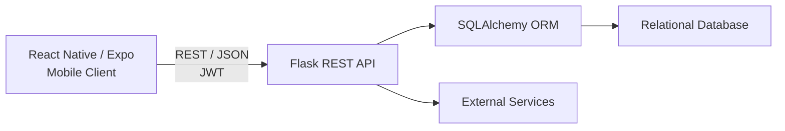
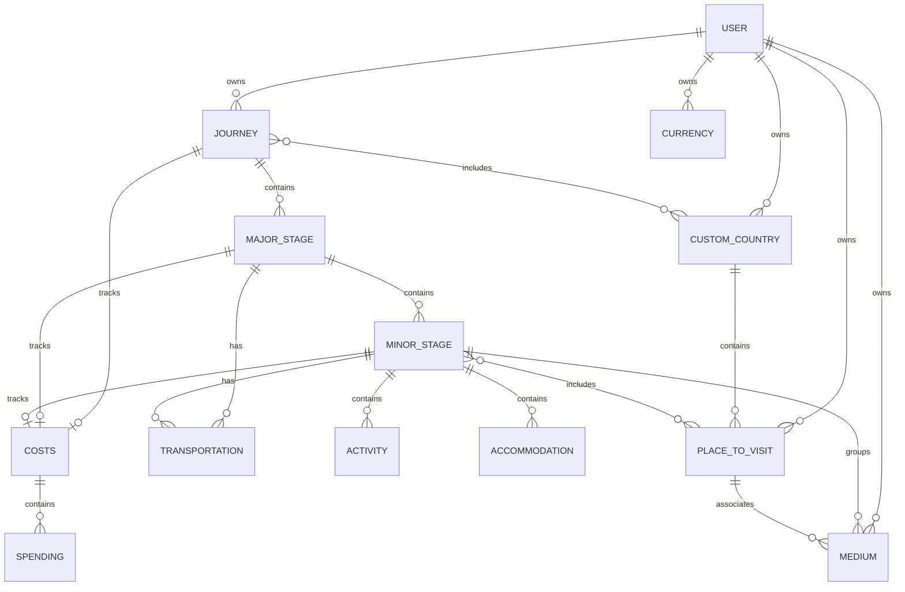

# TravelBuddy Backend

**REST API for the TravelBuddy mobile travel planning application.**

This repository contains the Python backend for TravelBuddy. It provides the REST API, authentication, relational data model and business logic used by the React Native mobile client.

The backend is built with **Flask** and **SQLAlchemy** and supports complex multi-stage journeys including destinations, transportation, accommodation, activities, expenses, currencies and travel media.

**Frontend Repository:**  
[TravelBuddy Frontend](https://github.com/Meilocora/TravelBuddy-frontend)

---

## Architecture

The backend acts as the central API and persistence layer of TravelBuddy.



The mobile client communicates with the backend through JSON-based REST endpoints. Authentication is handled with JWT access and refresh tokens.

---

## Tech Stack

| Area                | Technology                  |
| ------------------- | --------------------------- |
| **Language**        | Python                      |
| **Web Framework**   | Flask                       |
| **ORM**             | SQLAlchemy                  |
| **API**             | REST / JSON                 |
| **Authentication**  | JWT access & refresh tokens |
| **Database**        | Relational database         |
| **Testing**         | pytest, pytest-cov          |
| **Static Analysis** | Ruff                        |
| **CI**              | GitHub Actions              |
| **Configuration**   | python-dotenv               |

---

## Domain Model

TravelBuddy uses a hierarchical relational model designed around complex multi-stage journeys.



This structure allows costs, transportation, activities, accommodation, places and media to be associated with the appropriate level of a journey.

---

## API Structure

The API is separated into Flask blueprints based on domain responsibilities.

| Resource       | Base Route        |
| -------------- | ----------------- |
| Authentication | `/auth`           |
| Users          | `/user`           |
| Journeys       | `/journey`        |
| Major Stages   | `/major_stage`    |
| Minor Stages   | `/minor_stage`    |
| Countries      | `/country`        |
| Places         | `/place-to-visit` |
| Transportation | `/transportation` |
| Activities     | `/activity`       |
| Spendings      | `/spending`       |
| Media          | `/medium`         |
| Currencies     | `/currency`       |

The individual routes provide CRUD operations as well as domain-specific actions such as stage reordering, resource linking and travel-related data processing.

---

## Authentication & Authorization

TravelBuddy uses JWT-based authentication with separate access and refresh tokens.

Protected routes determine the authenticated user from the token rather than accepting a user ID supplied by the client.

### Resource Ownership

Authorization is enforced at resource level.

Ownership checks ensure that authenticated users can only access or modify resources belonging to their own account.

This includes both directly owned resources and nested resources such as:

```text
User
└── Journey
    └── MajorStage
        └── MinorStage
            ├── Activity
            ├── Accommodation
            └── Transportation
```

Related-resource validation also prevents a user from linking one of their own resources to an object owned by another account.

Ownership validation covers, among others:

- journeys
- major and minor stages
- activities
- transportation
- places and custom countries
- media
- currencies
- costs and spendings
- bulk operations
- reorder operations

Foreign resources are treated as unavailable rather than exposing whether an object belonging to another user exists.

---

## Testing

The backend uses **pytest** for automated testing.

A particular focus is placed on authorization and ownership boundaries.

Regression tests cover scenarios such as:

- accessing or deleting another user's resources
- modifying foreign nested resources
- reordering stages belonging to another user
- linking media to foreign resources
- creating places for foreign countries
- modifying child objects through unrelated parent resources
- preventing updates to one journey from affecting another journey

Tests run against an isolated test database so that the production or development database is not modified.

### Run all tests

```bash
python -m pytest -v
```

### Run tests with coverage

```bash
python -m pytest --cov=app --cov-report=term-missing
```

---

## Code Quality & Continuous Integration

**Ruff** is used for static code analysis and helps detect problems such as:

- undefined variables
- unused imports and variables
- unsafe exception handling
- common Python mistakes
- maintainability issues

Run Ruff locally:

```bash
ruff check .
```

GitHub Actions automatically executes code-quality checks and the automated test suite for repository changes.

This ensures that code quality checks and tests also pass in a clean environment independent of the local development setup.

---

## Project Structure

```text
TravelBuddy-backend/
├── app/
│   ├── routes/
│   │   ├── activity_routes.py
│   │   ├── auth_routes.py
│   │   ├── country_routes.py
│   │   ├── currency_routes.py
│   │   ├── journey_routes.py
│   │   ├── major_stage_routes.py
│   │   ├── medium_routes.py
│   │   ├── minor_stage_routes.py
│   │   ├── place_routes.py
│   │   ├── spending_routes.py
│   │   ├── transportation_routes.py
│   │   ├── user_routes.py
│   │   └── resource_access.py
│   │
│   ├── validation/
│   └── models.py
│
├── tests/
├── .github/
│   └── workflows/
├── .env.example
├── db.py
├── requirements.txt
├── requirements-dev.txt
└── server.py
```

---

## Getting Started

### Prerequisites

- Python 3.12+
- pip
- A supported relational database

### Clone the repository

```bash
git clone https://github.com/Meilocora/TravelBuddy-backend.git
cd TravelBuddy-backend
```

### Create a virtual environment

```bash
python -m venv venv
```

Windows:

```bash
venv\Scripts\activate
```

macOS / Linux:

```bash
source venv/bin/activate
```

### Install dependencies

```bash
pip install -r requirements.txt
```

For development, testing and linting:

```bash
pip install -r requirements-dev.txt
```

### Environment Configuration

Create a local `.env` file based on the provided example:

```bash
cp .env.example .env
```

Configure the required environment variables:

```env
GOOGLE_API_KEY=your_google_api_key
HOST=127.0.0.1
SECRET_KEY=your_secure_secret_key
SQLALCHEMY_DATABASE_URI=your_database_connection_string
FLASK_DEBUG=false
PORT=5001
```

Secrets and credentials are intentionally excluded from version control.

### Run the backend

```bash
python server.py
```

The API will then be available using the configured host and port.

---

## Security Notes

- Secrets are loaded from environment variables and are not committed to the repository.
- Protected endpoints require valid authentication.
- Resource ownership is verified server-side.
- Client-provided foreign keys are validated before relationships are created or modified.
- Database transactions are rolled back when write operations fail.
- Authorization behavior is covered by automated regression tests.

---

TravelBuddy is a personal full-stack portfolio project focused on building and refining a realistic mobile application architecture.

The core API, relational data model, authentication, resource-level authorization and automated security tests are implemented.

Current development focuses primarily on:

- maintainability
- code quality
- testing
- documentation
- API consistency

The project is not currently operated as a production commercial service.

---

## Related Repository

The React Native / Expo mobile application is available here:

**[TravelBuddy Frontend](https://github.com/Meilocora/TravelBuddy-frontend)**
